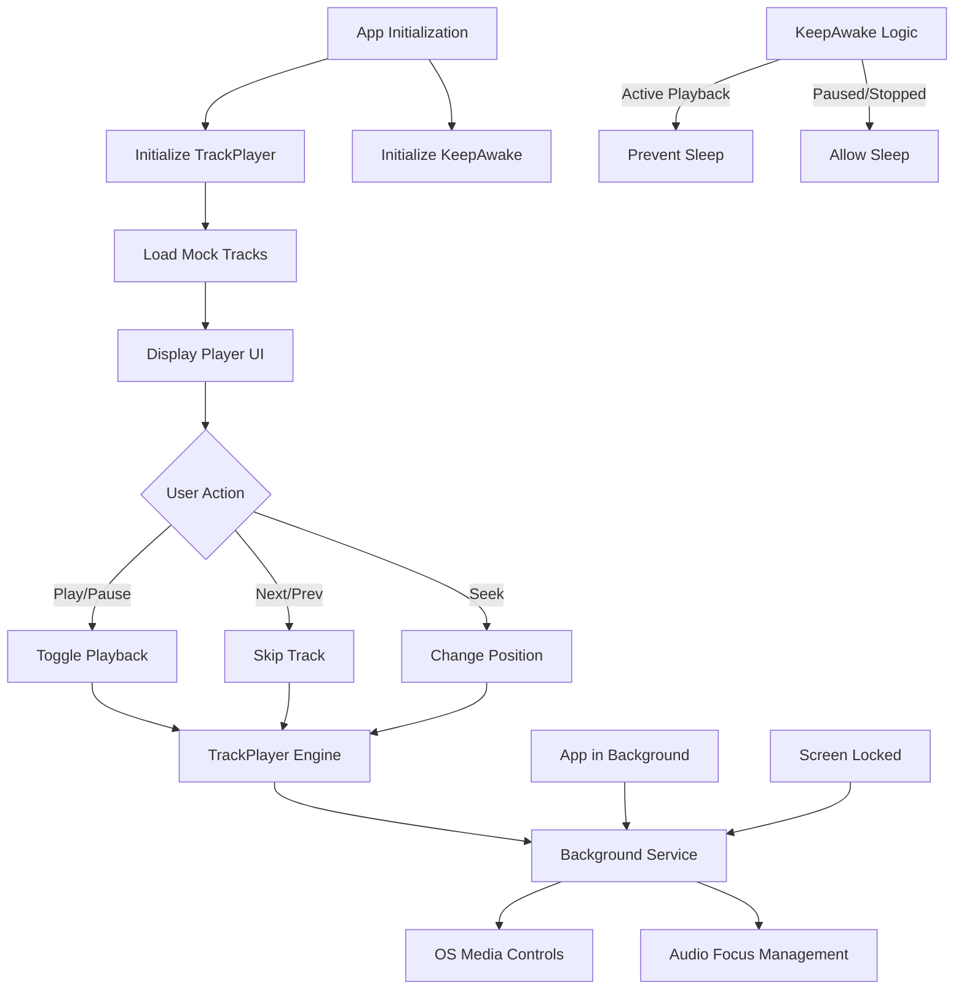

# System Flow - Music Bar Mobile



## Key Logic
1. **Background Service**: Handles events even when the app is minimized.
2. **Foreground Service**: Ensures the OS doesn't kill the playback process.
3. **Sleep Prevention**: Dynamically toggled based on playback state to save battery when not playing.
```
